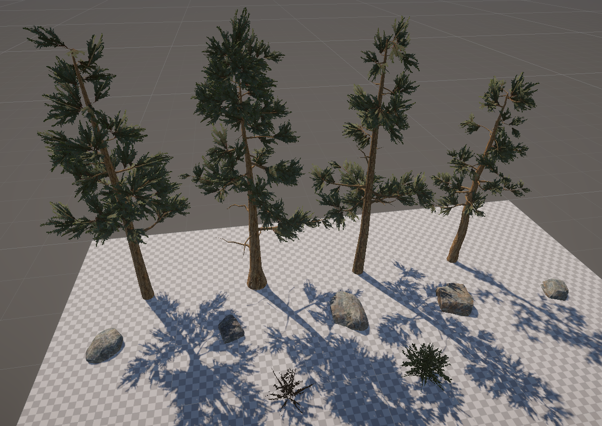
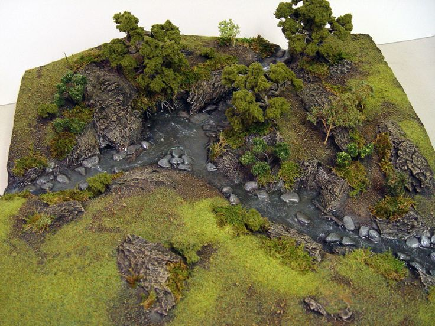

# Art Assignment

Welcome to Magnifica!

Here is a small environment for you to try and develop

the project is already setup with all the required basics

It is built on unity version 2021.2.19f1 you can go with a higher version but not lower

## Contents:
1. _Scenes/Env.unity - This is where the magic happens

## Requirements:

Use the reference image found in the Assets Folder as a guideline and try to arrange the terrain and build the environment using the provided assets found in the scene

Reference:

Feel free to import your own assets or create them from scratch using the tools you know

When you are done please send us a couple of screenshots of your work and a zip file containing the project
(If you are comfortable working with git you can fork this project and send us a link to the repo)
